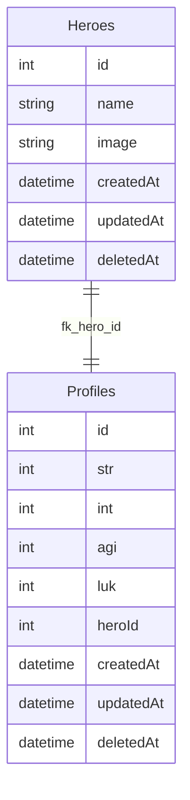

# 神盾局
這裏可以查詢最新 Marvels 登入的超級英雄們。

# How to Use
提供兩種啟動 local server 方式

1. 使用 docker copose 快速啟動
2. 手動啟動（如果 docker compose 有什麼問題無法順利啟動）

## 1. 使用 docker copose 快速啟動

### 確認以下工具必須準備
- docker
- docker-compose
- container 執行工具 (e.g. Docker Desktop, Orbstack, Colima...)

### 啟動
```
docker-compose up
```
會有三個 services 在啟動
- mysql-8.0_shield
- app
- migration_seeder

下面會做細部 dependency 介紹，這邊先簡短說明。

需要等到 `migration_seeder` 執行完，出現以下 log 
```
...
migration_seeder  | Executing (ad0778c5-cf3e-4e5e-a33b-ebbf5ce73fb2): COMMIT;
migration_seeder  | == 20240619151605-marvel-assemble-4: migrated (0.075s)
migration_seeder  | 
migration_seeder exited with code 0
```
代表 seeder 執行完成，建立基本 *四位英雄* 後，就可以 call api 了。如果還沒等到 migration_seeder 跑完就 call api 可能會出現 `internal error` 等錯誤訊息。

### 關閉
測試完後，直接 `ctrl+c` 然後執行以下就可以關閉 + 刪除 container 囉！
```
docker-compose down
```

## 2. 手動啟動
會需要先手動用 docker 建立 DB 在把 server 啟動。
### 啟動 Mysql container
```
docker run -d --name shield-test-mysql -p 3306:3306 -e MYSQL_USER=testuser -e MYSQL_PASSWORD=test -e MYSQL_ROOT_PASSWORD=test -e MYSQL_DATABASE=shield mysql
```

### 把 DB 建起來
1. 建立 tables
```
npm run migration-development
```
2. 塞入預設英雄資料
```
npm run seeds-development -- --seed 20240619151605-marvel-assemble-4.js
```

### 啟動 server 
```
npm run dev
```
啟動後就可以 call api 測試了。

# 架構介紹
由高到低分為以下階層
- http handler / middleware
- Repository
- Model
- Database


### http handler / middleware
這個階層會放在 `routes/` `middlewares/` 這兩個資料夾中。

`router` 主要功能是定義 `router` 以及驗證 request，以及 `error handler`。

`handler` 除了處理 request 參數以及 response 之外，還會寫簡單商業邏輯。目前因為沒什麼商業邏輯，單純直接調用 `Repository` 層去取得 database 資料，並做一些資料判斷。

[Refactor]: 未來假如商業邏輯變複雜，打算再抽出一層 `useCase` 專門處理商業邏輯。而 `handler` 層就只處理 `http request`, `http response` 相關資訊。

### Repository
這層主要是 ORM 的抽象層，用意是不要讓 ORM 直接跟商業邏輯暴露在一起。除了可以降低對 ORM 的關注，也可以把一些長的複雜的資料在這裡整理好。

### Model
這層就只是單純對 Sequelize 這款 ORM 的實作，把 database 中的資料建立成 DAO 方便程式碼操作。

### Database
因為從需求的資料來看，我認為英雄資料是很固定的規格，因此使用我熟悉的 MySQL。


一對一卻還要分成兩張 table 原因是我認為每位超級英雄的 profile 可能不僅止於那四個屬性，可能會有更複雜屬性，例如技能等等，因此獨立出 `Profiles` table 讓他可以做更複雜的關聯。

其中 `createdAt`, `updatedAt`, `deletedAt` 算是稽核作用，追蹤該筆資料狀態，並在 `deletedAt` 使用 Sequelize 預設的軟刪除功能。

# API Doc
`/api-docs`
可以從這邊看 api-doc

# 第三方套件使用
### express-validator
這是一個相容於 Express.js 框架的驗證套件。
他的用法相容於 express middleware 的用法，並且用法也很直觀。

### dotenv-flow
這款套件讓我可以使用多種環境變數檔，並且只要命名 pattern 是以下 `.env.{environment_name}` 就可以
他會根據當下的 `NODE_ENV` 去找相對應的環境檔，對於部署來說很好用

### supertest & jest
這款是 NodeJs 中常用的測試框架，因為時間關係，我只有做 E2E tests，因此使用了 supertest，並使用 jest mock 資料。

### Sequelize
這是 ORM 套件，也是我較熟悉的套件，選擇原因單純只是因為我比較熟悉，我希望快速建立 migration, seeder 等等檔案。

### express-swagger-jsdoc
可以藉由 JSDoc 直接產生 Swagger API Doc，簡單呼叫套件 API 即可秒產，如果沒有特殊需求，我認為這個方式產生非常方便。

# 註解原則

### Migrations

### Generation
```
npm run migration-generate -- --name ${file_name}
```
### Running Migrations
migration
```
npm run migration-{env}
```
undo migration
```
npm run migration-{env}-undo
```

## Seeders
### Generation
```
npm run seeds-generate -- --name ${file_name}
```

### Running seeds
create seeder (file name needs extension)
```
npm run seeds-{env} -- --seed ${file_name}.js
```
undo seeder (file name needs extension)
```
npm run seeds-development-undo -- --seed ${file_name}.js
```

# TODO
1. ~~test~~
2. docker compose 
3. eslint
4. comments & README
5. swagger
5. typescript