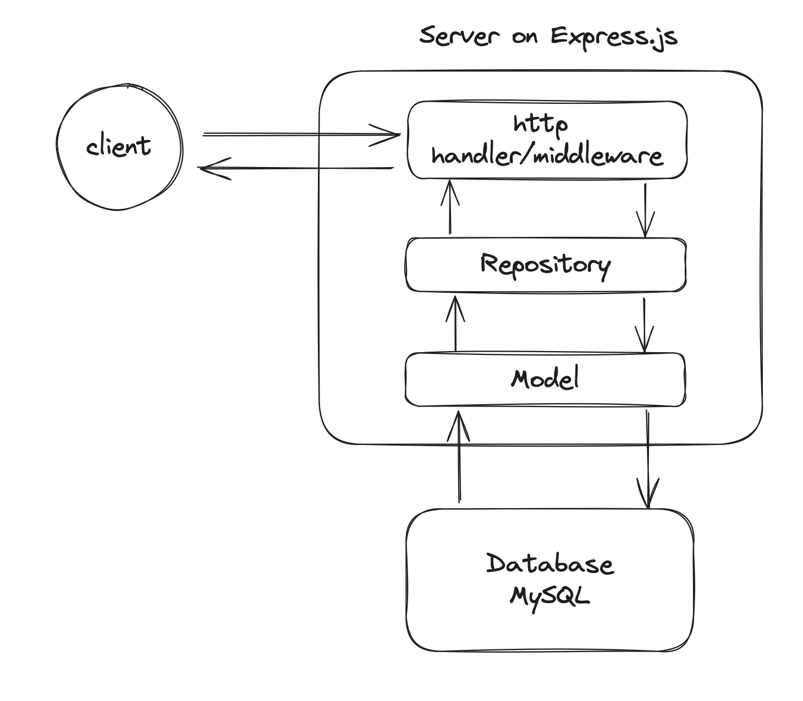
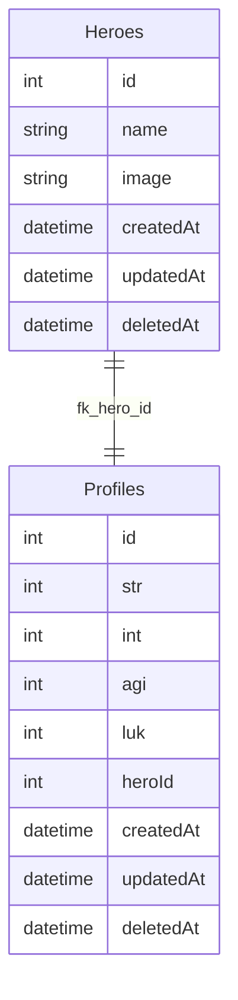

# 神盾局
這裏可以查詢最新 Marvel 登入的超級英雄們🦸🦸‍♀️

# How to Use
提供兩種啟動 local server 方式

1. 使用 docker copose 快速啟動
2. 手動啟動（如果 docker compose 有什麼問題無法順利啟動）

## 1. 使用 docker copose 快速啟動

### 確認以下工具必須準備
- docker
- docker-compose
- container 執行工具 (e.g. Docker Desktop, Orbstack, Colima...)

### 啟動
```
docker-compose up
```

需要等到 `migration_seeder` 執行完，出現以下 log 
```
...
migration_seeder  | Executing (ad0778c5-cf3e-4e5e-a33b-ebbf5ce73fb2): COMMIT;
migration_seeder  | == 20240619151605-marvel-assemble-4: migrated (0.075s)
migration_seeder  | 
migration_seeder exited with code 0
```
代表 seeder 執行完成，建立基本 *四位英雄* 後，就可以 call api 了。

**注意** 如果還沒等到 migration_seeder 跑完就 call api 可能會出現 `internal error` 等錯誤訊息。

## 2. 手動啟動
會需要先手動用 docker 建立 DB 在把 server 啟動。
### 啟動 Mysql container
```
docker run -d --name shield-test-mysql -p 3306:3306 -e MYSQL_USER=testuser -e MYSQL_PASSWORD=test -e MYSQL_ROOT_PASSWORD=test -e MYSQL_DATABASE=shield mysql
```

### 把 DB 建起來
1. 建立 tables
```
npm run migration-development
```
2. 塞入預設英雄資料
```
npm run seeds-development -- --seed 20240619151605-marvel-assemble-4.js
```

### 啟動 server 
```
npm run dev
```

# 架構介紹
由高到低分為以下階層
- http handler / middleware
- Repository
- Model
- Database
---


### http handler / middleware
```
相關檔案：

├── src                                          
│   ├── middlewares                 
│   └── routes                      
│         └── handlers              
```
- middlewares: 
    - 驗證 request auth header
    - error-handler 
- routes: 定義 endpoints
    - routeSkipperByValidation: 需求是，檢查是否有帶入正確的 header，如有，會回 HeroProfile。因此我寫了兩個 handlers，一個拿 Hero， 一個拿 HeroProfile。透過這個 middleware 決定要跳到哪個 handler。
    - 兩個 handler：這邊會想寫兩個 handler，是因為我認為本質是不同 use case，若混在同一個 handler，會將商業邏輯混到 http header，若未來變複雜，可能不好分層。
- handlers: 目前把商業邏輯寫在這邊，因為目前只有從 repository 層取資料

[Refactor]: 未來假如商業邏輯變複雜，打算再抽出一層 `use-case` 專門處理商業邏輯。而 `handler` 層就只處理 `http request`, `http response` 相關資訊。

### Repository
```
相關檔案：

├── src                                          
│   ├── repositories                 
│   └── ...             
```
這層主要是 ORM 的抽象層，用意是不要讓 ORM 直接跟商業邏輯暴露在一起。除了可以降低對 ORM 的關注，也可以把一些長的複雜的資料在這裡整理好。

### Model
```
相關檔案：

├── src                                          
│   ├── connections                 
│   └── models          
```
這層就只是單純對 Sequelize 這款 ORM 的實作，把 database 中的資料建立成 DAO 方便程式碼操作，並建立連線。

### Database
因為從需求的資料來看，我認為英雄資料是很固定的規格，因此使用我熟悉的 MySQL。


一對一卻還要分成兩張 table 原因是我認為每位超級英雄的 profile 可能不僅止於那四個屬性，可能會有更複雜屬性，例如技能等等，因此獨立出 `Profiles` table 讓他可以做更複雜的關聯。

其中 `createdAt`, `updatedAt`, `deletedAt` 算是稽核作用，追蹤該筆資料狀態，並在 `deletedAt` 使用 Sequelize 預設的軟刪除功能。

# API Doc
`/api-docs`
可以從這邊看 api-doc

# 第三方套件使用
### express-validator
這是一個相容於 Express.js 框架的驗證套件。
他的用法相容於 express middleware 的用法，並且用法也很直觀。

### dotenv-flow
這款套件讓我可以使用多種環境變數檔，並且只要命名 pattern 是以下 `.env.{environment_name}` 就可以
他會根據當下的 `NODE_ENV` 去找相對應的環境檔，對於部署來說很好用

### supertest & jest
這款是 NodeJs 中常用的測試框架，因為時間關係，我只有做 E2E tests，因此使用了 supertest，並使用 jest mock 資料。

### Sequelize
這是 ORM 套件，也是我較熟悉的套件，選擇原因單純只是因為我比較熟悉，我希望快速建立 migration, seeder 等等檔案。

### express-swagger-jsdoc
可以藉由 JSDoc 直接產生 Swagger API Doc，簡單呼叫套件 API 即可秒產，如果沒有特殊需求，我認為這個方式產生非常方便。

### pm2
這個工具寫在 Dockerfile 中，用意為避免程式意外關閉，整個 container 就停止。

# 註解原則
1. 變數、function、method 命名已經不夠解釋請楚
2. 看起來很不一般的用法
3. 多步驟的邏輯，會使用 1./2. .. 標示步驟，讓邏輯比較清晰 

# 挑戰
1. docker compose：過程中花蠻多時間 debug 環境變數，參數設置等等。很可惜時間關係還沒有處理得很完整。
2. sequelize migration：一開始有在想資料來源要直接 call hahow api 就好，還是自己建立 DB。決定勇敢一回建立 DB，因此面對 0->1 構思要怎麼寫 model, migration 等等。
3. handler：本來想要單純用 if/else 處理 auth header，但突然想到有 `next('route')` 這個用法很適合，因此想嘗試這個寫法，花了點時間創造這個 middleware。